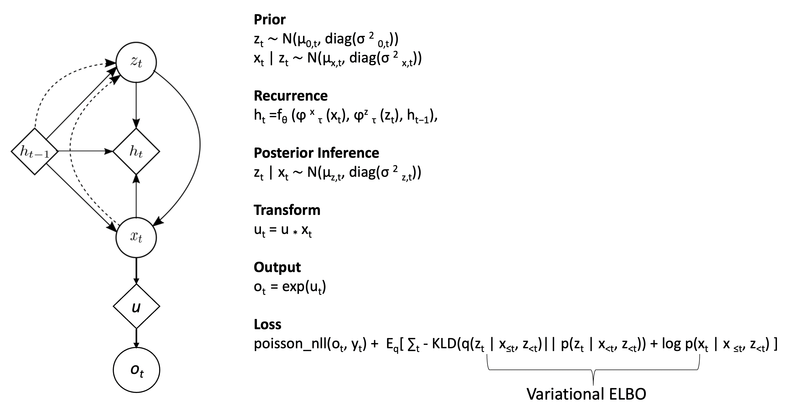

# ECE695-finalproject
# Variational-RNN for Joint Neural Latent Generation and Prediction
The task is to predict future time steps, held out neuron spikes and decode behaviour of monkey from given spike data.
To accomplish this I used V-RNN, where V helps model inherent noise in the measurements made and generalize better. This is important as neural signals are considered highly noisy. RNN captures the sequential information. A linear layer is used to predict held out neurons. I achieved co-bps ~0.07 bits/spikes with 2500 epochs. 



## Data 
Dataset: MC_Maze dataset from Shenoy's Lab

To download we use ```dandi```. Install and download dataset as follows:

```
pip install dandi
```
For download, go to [MC_maze](https://neurallatents.github.io/datasets#mcmaze) and copy link of required size from dandi repo and download as follows
```
dandi download <link>
```

## Installation
```
pip install git+https://github.com/neurallatents/nlb_tools.git
pip install torch
pip install evalai
```
## Run
To run, change the `data_path`, `dataset_name` and epochs  in `main.py` and run the file.
This does the following:
1. Train the model on the given data set and create checkpoint
2. Create log files with train and validation loss
3. Evaluate the checkpoint and save the results in eval_log.csv
4. Generate and save loss plots


## References
1. VRNN model is from [Chung et. al. 2016](https://arxiv.org/abs/1506.02216)
2. I extended the pytorch implementation from [VariationalRecurrentNeuralNetwork](https://github.com/emited/VariationalRecurrentNeuralNetwork) to include:
    1. Predicting future steps 
    2. Predicting held out neurons
3. I used NLBRunner runner class from [neurallatents](https://github.com/neurallatents/nlb_workshop) and added plotting and loggers for evaluation output.
